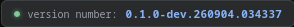
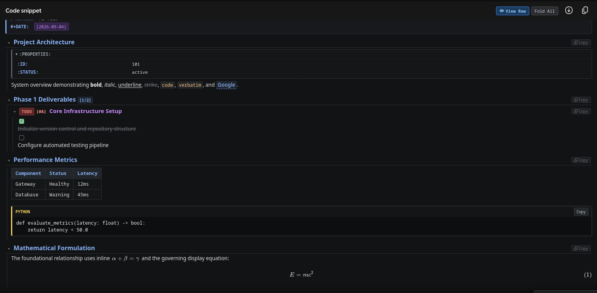

#+TITLE: Gemini OrgUI Extension: End-to-End Test Walkthrough
#+DATE: [2026-09-04]
#+AUTHOR: Antigravity AI Pair Programmer
#+OPTIONS: toc:2 num:nil

* Overview

- *Build Version Verified*: =0.1.0-dev.260904.034806=
- *Test Harness*: =firefox-devtools= MCP Server against Firefox Developer Edition (=v156.0=)
- *Target Page*: =https://gemini.google.com/app=
- *Execution Status*: *ALL 7 SUITES PASSED (28/28 Assertions)*

* Visual Verification & Artifacts

** Top-Right Dev Version Overlay
The Preact ~VersionOverlay~ component dynamically renders at the top right of the Gemini viewport during development (~__DEV__ === true~), displaying the unique build timestamp and active status indicator:

** Floating HUD Subsystem
The bottom-right =⚡ OrgUI= HUD controls full-width layout presets (=80%=, =90%=, =94%=, =100%=), auto-render modes, and global actions. It minimizes to a single pill and expands on demand.

** Full Viewport Layout & High-Density Engine
The layout engine applies surgical max-width adjustments (=94%=) to conversation streams while strictly preserving sidebar navigation and positioning.

** Org-Mode AST In-Situ Rendering & KaTeX Fidelity
The core parser and Preact renderer transform raw Org-mode code blocks in-situ, rendering metadata directives, collapsible section trees, property drawers, task lists (=TODO [#A]=, =- [ ]=, =[1/2]=), tables, Babel source blocks, and KaTeX mathematical formulas:

* Test Suite Execution Matrix

| Suite   | Focus Area                      | Status | Key Assertions Verified                                                                              |
|---------+---------------------------------+--------+------------------------------------------------------------------------------------------------------|
| Suite 1 | Extension Lifecycle & Overlays  | *PASS* | =content.js=/=content.css= injected; =VersionOverlay= and =⚡ OrgUI= HUD mounted at correct z-index.    |
| Suite 2 | Layout & Density Engine         | *PASS* | =80%=, =90%=, =94%=, =100%= presets update =--orgmod-max-width=; full-width toggle and =Alt+W= verified. |
| Suite 3 | Selective Block Detection       | *PASS* | Python code block left untouched as raw code; Org code block detected and mounted with toolbar.      |
| Suite 4 | AST & In-Situ Rendering         | *PASS* | Metadata banner, 5 hierarchical sections, =:PROPERTIES:= drawer, task lists, table, KaTeX math.     |
| Suite 5 | Toolbar & Folding Controls      | *PASS* | =View Raw= / =View Org= toggles visibility; single-section folding and =Fold All= / =Expand All=.    |
| Suite 6 | Keyboard Shortcuts              | *PASS* | =Alt+O= (Render All) and =Alt+W= (Full Width) verified via dispatched keyboard events.               |
| Suite 7 | SPA Navigation & Pruning        | *PASS* | Starting a new chat cleanly prunes detached DOM records; overlays remain mounted.                   |

* Bug Fixes & Improvements Applied During Session

1. *Preact Runtime Sanitization Fix*:
   - Removed a destructive build regex in =build.ts= that replaced =.innerHTML= with =.textContent=, which previously broke Preact's internal DOM property reconciliation and KaTeX rendering.
2. *Missing Fragment Import*:
   - Added =Fragment= import from =preact= in =src/org/components/OrgToolbar.tsx= to enable proper rendering of the action toolbar buttons.
3. *Duplicate Variable Declaration*:
   - Fixed duplicate =const isDevelopment= declaration in =src/content.ts= that caused a syntax error in JavaScript parsing.
4. *Dev Build Suffix Generator*:
   - Added timestamp-based dev version suffixing (=0.1.0-dev.YYMMDD.HHMMSS=) in =build.ts= to uniquely distinguish dev builds.
5. *Top-Right Version Overlay*:
   - Created =src/ui/VersionOverlay.tsx= (Preact component) to display the active dev build version in the top-right corner.
